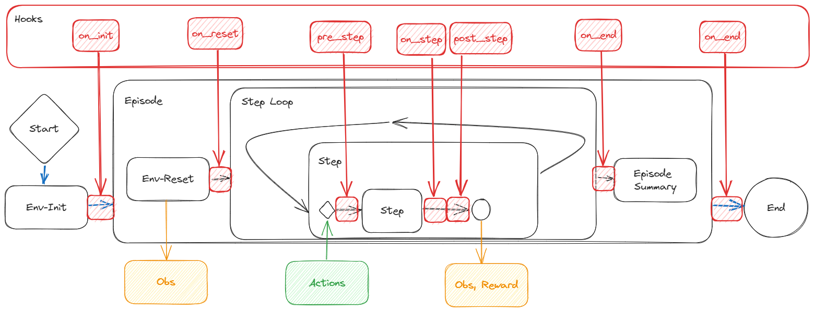

# About EDYS

by Steffen Illium, Joel Friedrich, Julian Schönberger, Robert Müller, Fabian Ritz

## Tackling emergent dysfunctions (EDYs) in cooperation with Fraunhofer-IKS.

Collaborating with Fraunhofer-IKS, this project is dedicated to investigating Emergent Dysfunctions (EDYs) within
multi-agent environments. In multi-agent reinforcement learning (MARL), a population of agents learns by interacting
with each other in a shared environment and adapt their behavior based on the feedback they receive from the environment
and the actions of other agents.

In this context, emergent behavior describes spontaneous behaviors resulting from interactions among agents and
environmental stimuli, rather than explicit programming. This promotes natural, adaptable behavior, increases system
unpredictability for dynamic learning , enables diverse strategies, and encourages collective intelligence for complex
problem-solving. However, the complex dynamics of the environment also give rise to emerging dysfunctions—unexpected
issues from agent interactions. This research aims to enhance our understanding of EDYs and their impact on multi-agent
systems.

### Project Objectives:

- Create an environment that provokes emerging dysfunctions.

    - This is achieved by creating a high level of background noise in the domain, where various entities perform
      diverse tasks,
      resulting in a deliberately chaotic dynamic.
    - The goal is to observe and analyze naturally occurring emergent dysfunctions within the complexity generated in
      this dynamic environment.


- Observational Framework:

    - The project introduces an environment that is designed to capture dysfunctions as they naturally occur.
    - The environment allows for continuous monitoring of agent behaviors, actions, and interactions.
    - Tracking emergent dysfunctions in real-time provides valuable data for analysis and understanding.


- Compatibility
    - The Framework allows learning entities from different manufacturers and projects with varying representations
      of actions and observations to interact seamlessly within the environment.


- Placeholders

    - One can provide an agent with a placeholder observation that contains no information and offers no meaningful
      insights.
    - Later, when the environment expands and introduces additional entities available for observation, these new
      observations can be provided to the agent.
    - This allows for processes such as retraining on an already initialized policy and fine-tuning to enhance the
      agent's performance based on the enriched information.

## Usage

The majority of environment objects, including entities, rules, and assets, can be loaded automatically.
Simply specify the requirements of your environment in a [
*yaml*-config file](marl_factory_grid/configs/default_config.yaml).

Two example scripts, that show how you can execute different agents in varying configurations of the environment can be 
found in ```env_examples```.

Existing modules include a variety of functionalities within the environment:

- [Agents](marl_factory_grid/algorithms) implement either static strategies or learning algorithms based on the specific
  configuration.
- Their action set includes opening [door entities](marl_factory_grid/modules/doors/entitites.py), collecting [coins](marl_factory_grid/modules/coins/entitites.py)  cleaning
  [dirt](marl_factory_grid/modules/clean_up/entitites.py), picking
  up [items](marl_factory_grid/modules/items/entitites.py) and
  delivering them to designated drop-off locations.
- Agents can be equipped with a [battery](marl_factory_grid/modules/batteries/entitites.py) that gradually depletes over
  time if not charged at a chargepod.
- The [maintainer](marl_factory_grid/modules/maintenance/entities.py) aims to
  repair [machines](marl_factory_grid/modules/machines/entitites.py) that lose health over time.

## Customization

You can modify the environment in various ways, by for example adding level, entities or rules.


### Levels

Varying levels are created by defining Walls, Floor or Doors in *.txt*-files (see [levels](marl_factory_grid/levels) for
examples).
Define which *level* to use in your *configfile* as:

```yaml
General:
  level_name: rooms  # 'double', 'large', 'simple', ...
```

... or create your own , maybe with the help of [asciiflow.com](https://asciiflow.com/#/).
Make sure to use `#` as [Walls](marl_factory_grid/environment/entity/wall.py), `-` as free (walkable) floor, `D`
for [Doors](marl_factory_grid/modules/doors/entitites.py).
Other Entites (define you own) may bring their own `Symbols`

### Entites

Entites are [Objects](marl_factory_grid/environment/entity/object.py) that can additionally be assigned a position.
Abstract Entities are provided.

If you wish to introduce new entities to the environment just create a new module that implements the entity class. 
If necessary, provide additional classe such as custom actions or rewards and load the entity into the environment 
using the config file.

### Groups

[Groups](marl_factory_grid/environment/groups/objects.py) are entity Sets that provide administrative access to all
group members.
All [GlobalEntities](marl_factory_grid/environment/groups/global_entities.py) are available at runtime as EnvState property.

### Rules

[Rules](marl_factory_grid/environment/rules.py) define how the environment behaves on microscale.
Each of the hookes (`on_init`, `pre_step`, `on_step`, '`post_step`', `on_done`)
provide env-access to implement custom logic, calculate rewards, or gather information.

If you wish to introduce new rules to the environment make sure it implements the Rule class and override its' hooks to 
implement your own rule logic.



[Results](marl_factory_grid/environment/entity/object.py) provide a way to return `rule` evaluations such as rewards and
state reports back to the environment.

### Assets

Make sure to bring your own assets for each Entity living in the Gridworld as the `Renderer` relies on it.
PNG-files (transparent background) of square aspect-ratio should do the job, in general.

 
<!--suppress HtmlUnknownAttribute -->
<html &nbsp&nbsp&nbsp&nbsp html> 


